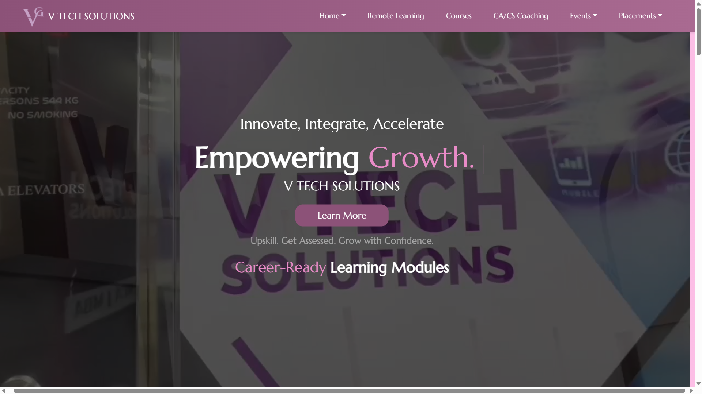
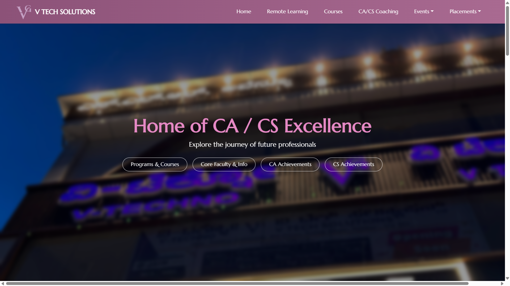
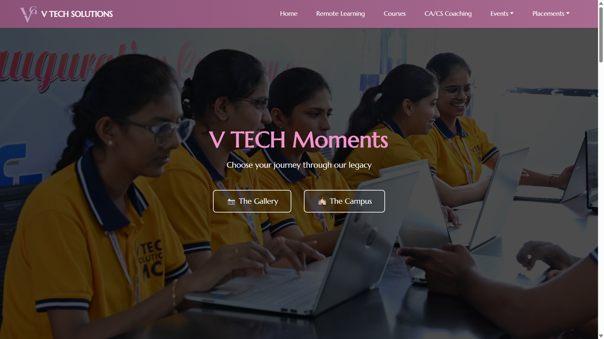
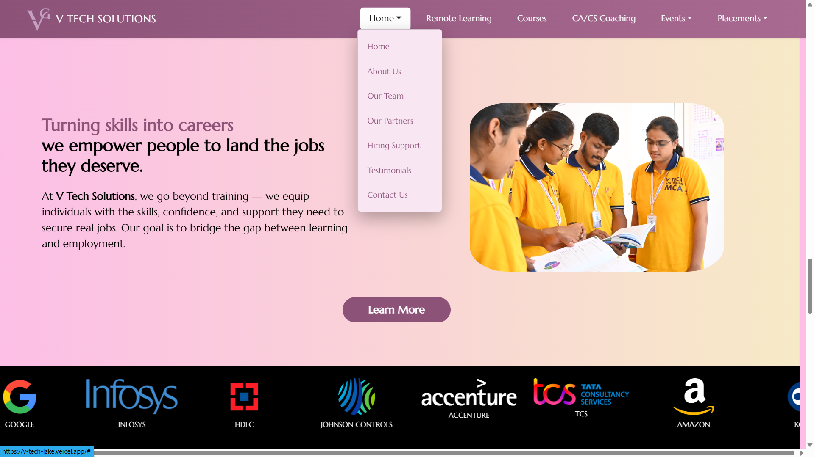

# 🎓 V-Tech

> **A modern training institute platform for exploring courses, booking appointments, and connecting students with quality technical education through an engaging web experience.**

<p align="center">
  
</p>

---

# 🌐 Experience V-Tech

Ready to explore quality technical education?

## 🚀 Visit the Website

### https://v-tech-lake.vercel.app

Discover professional training programs, explore courses, schedule appointments, and connect with an institute dedicated to helping students build successful careers.

---

# 🏛️ Overview

V-Tech is a responsive web application developed for a Computer Science and CA/CS training institute.

Built with **React**, the platform allows prospective students to explore training programs, learn about the institute, schedule appointments, and connect with instructors through an intuitive and modern interface.

Designed as a lightweight client-side application, V-Tech delivers a fast, responsive, and user-friendly experience while providing a strong foundation for future expansion.

---

# ✨ Features

- 📚 Explore professional training programs
- 🎓 Browse Computer Science and CA/CS courses
- 📅 Book appointments through EmailJS
- 🏫 Learn about the institute and faculty
- 📞 Contact and enquiry forms
- 📖 Detailed course information
- 🎨 Modern and interactive interface
- ⚡ Fast React-powered experience
- 📱 Fully responsive across all devices
- ☁️ Live deployment on Vercel

---

# 🚀 Tech Stack

| Category | Technologies |
|-----------|--------------|
| Frontend | React |
| Routing | React Router |
| Styling | Bootstrap 5, CSS3 |
| Forms | EmailJS |
| Deployment | Vercel |
| Language | JavaScript (ES6+) |

---

# 📂 Project Structure

```text
V-Tech
├── public
├── src
│   ├── components
│   ├── pages
│   ├── utils
│   ├── App.js
│   └── index.js
├── package.json
└── README.md
```

---

# ⚡ Getting Started

### Clone the repository

```bash
git clone https://github.com/sameer-khan-a/V-Tech-.git
```

### Navigate into the project

```bash
cd V-Tech-
```

### Install dependencies

```bash
npm install
```

### Start the development server

```bash
npm run dev

# or

npm start
```

---

# 📸 Screenshots

## 🏠 Home Page


---

## 📚 Courses



---

## 🏫 Institute Information



---

## 📅 Appointment Booking



---

# 🛣️ Roadmap

- [x] Responsive website
- [x] Course information pages
- [x] Appointment booking with EmailJS
- [x] Contact and enquiry forms
- [x] Modern React interface
- [x] Live deployment
- [ ] Student portal
- [ ] Online admissions
- [ ] Admin dashboard
- [ ] Backend integration
- [ ] Learning management features

---

# 💡 Why V-Tech?

Many educational websites provide only basic information about their courses.

**V-Tech** offers a more engaging digital experience by allowing prospective students to explore programs, learn about the institute, submit enquiries, and schedule appointments through an intuitive and responsive interface.

Built with React and integrated with EmailJS, the project demonstrates modern frontend development, responsive design principles, reusable component architecture, and seamless client-side form handling.

---

# 🤝 Contributing

Contributions, suggestions, and improvements are always welcome.

1. Fork the repository.
2. Create a feature branch.
3. Commit your changes.
4. Open a Pull Request.

---

# 👨‍💻 Author

**Sameer Khan**

If you found this project interesting, consider giving it a ⭐ on GitHub. Your support helps improve and grow the project.
